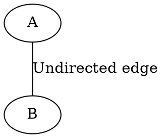
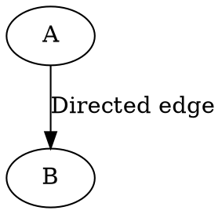

# Inline `graphviz` Graphs

Here's a simple undirected graph rendered by the new build system:

```graphviz
graph simple {
  a [label="A"];
  b [label="B"];

  a -- b [label="Undirected edge"];
}
```

Here's a directed graph:

```graphviz
digraph simple {
  a [label="A"];
  b [label="B"];

  a -> b [label="Directed edge"];
}
```
